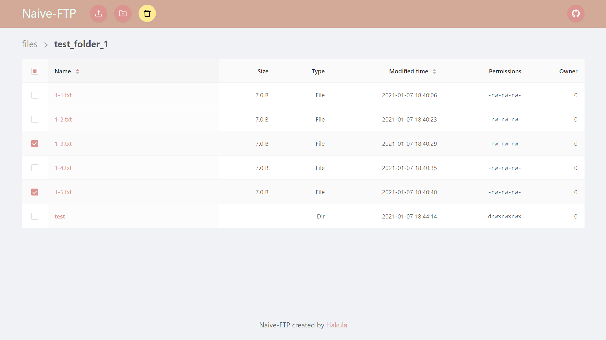
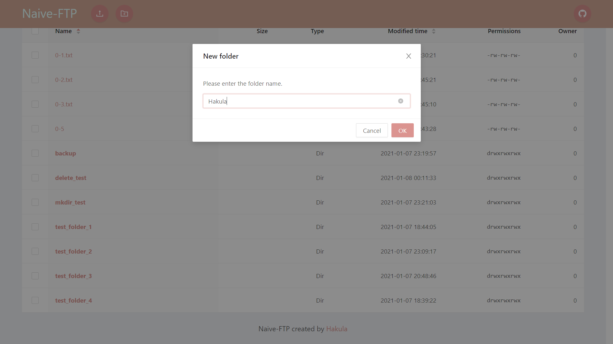
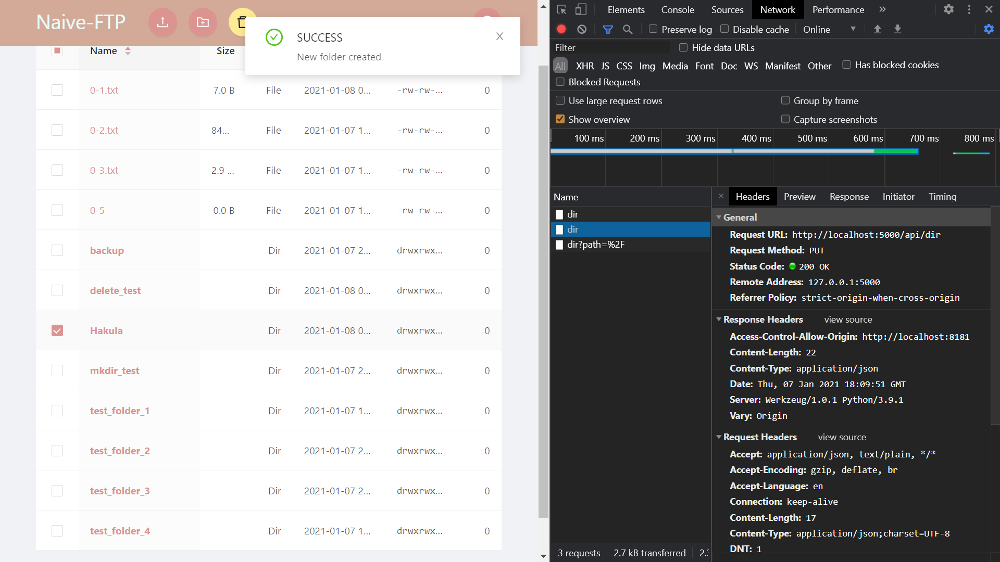
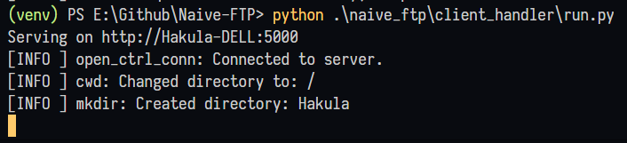
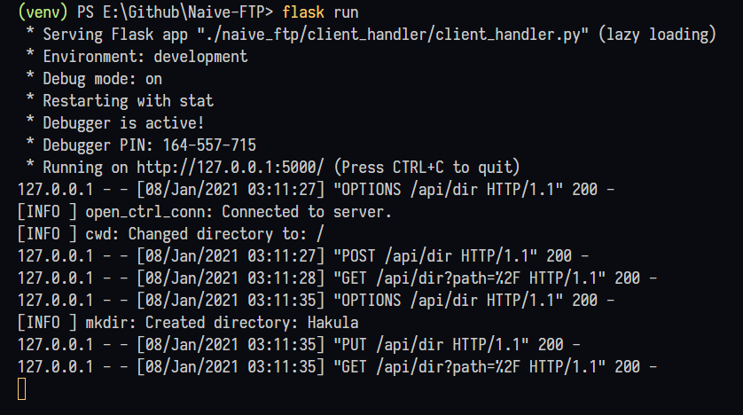
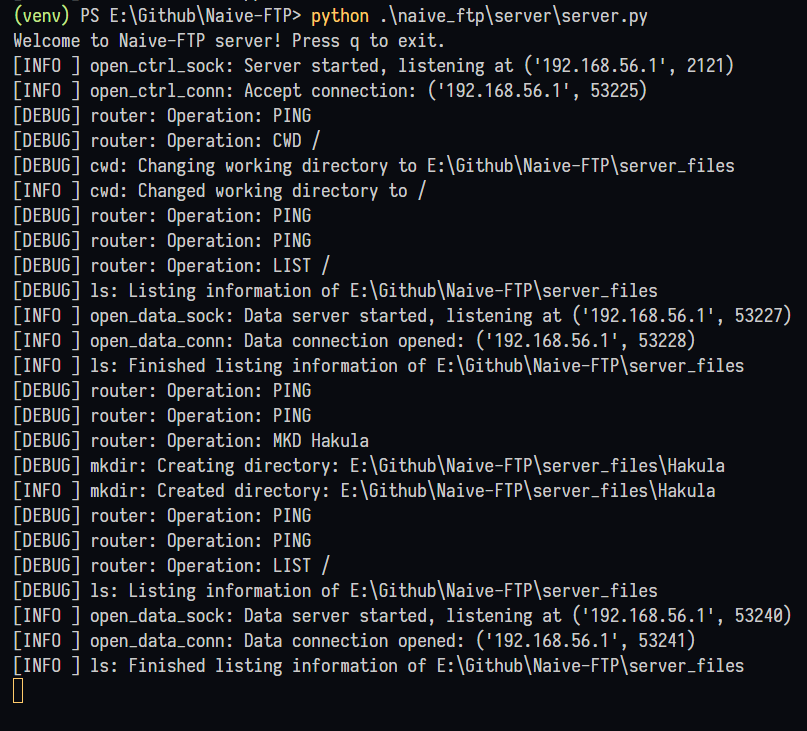
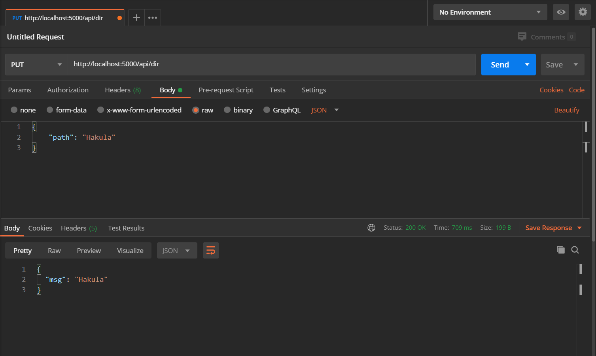

# Naive-FTP

A simple FTP server and client, written in TypeScript and Python 3.



## Table of Contents

- [Naive-FTP](#naive-ftp)
  - [Table of Contents](#table-of-contents)
  - [Overview](#overview)
  - [Getting Started](#getting-started)
    - [0. Prerequisites](#0-prerequisites)
    - [1. Installation](#1-installation)
      - [1.1 GUI support](#11-gui-support)
    - [2. Usage](#2-usage)
      - [2.1 Server](#21-server)
      - [2.2 Client CLI](#22-client-cli)
      - [2.3 Client handler](#23-client-handler)
    - [2.4 Client GUI](#24-client-gui)
  - [How it works](#how-it-works)
    - [1. Client GUI](#1-client-gui)
    - [2. Client GUI -> Axios -> Client handler](#2-client-gui---axios---client-handler)
    - [3. Client handler -> Server -> Client handler](#3-client-handler---server---client-handler)
    - [4. Client handler -> Axios -> Client GUI](#4-client-handler---axios---client-gui)
  - [TODO](#todo)
  - [Contributors](#contributors)
  - [License](#license)

## Overview

- The front-end is developed with [Vue 3](https://v3.vuejs.org), and designed based on [Ant Design of Vue](https://2x.antdv.com)
- A local server for client GUI is built with [Express](https://expressjs.com) for [Node.js](https://nodejs.org)
- The back-end implements a subset of the File Transfer Protocol (FTP) with pure `socket` module in Python
- [Axios](https://github.com/axios/axios) and [Flask](https://flask.palletsprojects.com) are utilized as middleware to support client side and server side respectively; communications are based on REST APIs, and all transferring data is compressed with Gzip
- Support multithreading, taking advantage of the `threading` module in Python

## Getting Started

### 0. Prerequisites

To set up the environment, you need to have the following dependencies installed.

- [Python](https://www.python.org/downloads) 3.7 or later
- [Node.js](https://nodejs.org/en/download) 13 or later
- [Yarn](https://classic.yarnpkg.com/en/docs/install)

### 1. Installation

First, obtain the Naive-FTP package.

```bash
git clone https://github.com/hakula139/Naive-FTP.git
cd Naive-FTP
```

Before installing, it's recommended to set up a virtual environment, so that any changes will not affect your global configuration.

```bash
python -m venv venv
./venv/Scripts/activate
```

Now you can build the project using `setup.py`.

```bash
python setup.py install
```

Make sure you have the latest version of `setuptools` installed.

```bash
python -m pip install --upgrade setuptools
```

#### 1.1 GUI support

A GUI is optional for Naive-FTP, so if you prefer to use a CLI, you can safely skip this step.

Here we use yarn to build the client GUI. It may take some time, so perhaps there's time for you to make yourself a cup of coffee... if you like.

```bash
cd app && yarn && yarn build && cd ..
```

Besides, the following dependencies are required for the client handler, which provides REST APIs for the client GUI to communicate with the server. Install these packages using [pip](https://pypi.org/project/pip).

```bash
pip install flask waitress
```

### 2. Usage

#### 2.1 Server

After a successful installation, you can start the Naive-FTP server using the command below. The server will listen to port `2121` by default.

```bash
python ./naive_ftp/server/server.py
```

You should see the following welcome message. Press `q` to exit.

```text
Welcome to Naive-FTP server! Press q to exit.
```

#### 2.2 Client CLI

If you just want to use a CLI, use this command to start one. The client will attempt to establish a connection to `localhost:2121` by default.

```bash
python ./naive_ftp/client/client.py
```

To get started, try the command `help` to show all available commands. All commands are case-insensitive.

```text
> help
```

Currently, we support the commands as follows.

```text
HELP                         Show a list of available commands.      
OPEN                         Open a connection to server.
QUIT                         Close all connections and quit.
EXIT                         Close all connections and quit.
LIST <server_path>           List information of a file or directory.
LS   <server_path>           List information of a file or directory.
RETR <server_path>           Retrieve a file from server.
GET  <server_path>           Retrieve a file from server.
STOR <local_path>            Store a file to server.
PUT  <local_path>            Store a file to server.
DELE <server_path>           Delete a file from server.
DEL  <server_path>           Delete a file from server.
RM   <server_path>           Delete a file from server.
CWD  <server_path>           Change working directory.
CD   <server_path>           Change working directory.
PWD                          Print working directory.
MKD  <server_path>           Make a directory recursively.
MKDI <server_path>           Make a directory recursively.
RMD  <server_path>           Remove a directory.
RMDI <server_path>           Remove a directory.
RMDA <server_path>           Remove a directory recursively.
```

#### 2.3 Client handler

To make the GUI work in a proper way, you need to launch the client handler beforehand.

```bash
python ./naive_ftp/client_handler/run.py
```

You should see something like:

```text
Serving on http://Hakula-DELL:5000
```

### 2.4 Client GUI

Finally, start the local server and check the web page at <http://localhost:8181>.

```bash
node server.mjs
```

The server files and local files are located in `./server_files` and `./local_files` by default. You may need to manually create them if not exist.

```bash
mkdir server_files
mkdir local_files
```

By far, we support these features in our GUI:

- List the files in a directory
  - Along with their information, namely, file name, file size, file type, last modified time, permissions and owner
  - Hidden files will not be displayed
  - *FTP command*: `LIST /dir_path`
- Change directory to another path
  - *FTP command sequence*: `CWD /dir_path`, `LIST /dir_path`
- Upload a file
  - *FTP command*: `STOR /file_path`
- Download a file
  - *FTP command*: `RETR /file_path`
- Create a new folder
  - Recursively
  - *FTP command*: `MKDIR /dir_path`
- Mass delete files and directories
  - Directories will be removed recursively
  - *FTP commands*: `DELE /path` (for files), `RMDA /dir_path` (for directories)

## How it works

The entire communication process is illustrated as follows.

### 1. Client GUI



To start with, we suppose that a user is interacting with the *client GUI* in a browser, and somehow performs an operation (e.g. create a directory).

### 2. Client GUI -> Axios -> Client handler

The user operation is processed by Vue, interpreted into HTTP requests, and then sent to a local API server using Axios.



Here we call the API server a *client handler*, which helps the client to communicate with the server.

### 3. Client handler -> Server -> Client handler

Next, the client handler processes the HTTP request from Axios, and sends FTP requests to the server. The server understands the request and does some operations (here it creates a directory), and consequently returns a FTP response based on the status of this operation.



We can see more details in development mode.



Besides, you may check the logs on server side to see how the server reacts to the FTP requests.



### 4. Client handler -> Axios -> Client GUI

Finally, the client handler parses the server response (sometimes along with data) to JSON format, and returns back to the client GUI. Some messages may be shown on client side to indicate whether the operation is successful or not.

You may try [Postman](https://www.postman.com) to inspect how the API works.



## TODO

- [x] Implement a GUI using Flask and Vue.js
  - [x] Set up Vue.js
  - [x] Set up Axios
  - [x] Set up Flask
- [x] Compose a detailed document
- [ ] Add more features (if I had time) ;(
  - [ ] Rename
  - [ ] Download a folder
  - [ ] Batch download
  - [ ] Upload a folder
  - [ ] Batch upload
  - [ ] Upload through selecting a file instead of manually inputing a path

## Contributors

- [**Hakula Chen**](https://github.com/hakula139)<[i@hakula.xyz](mailto:i@hakula.xyz)> - Fudan University

## License

This project is licensed under the GNU General Public License v3.0 - see the [LICENSE](./LICENSE) file for details.
